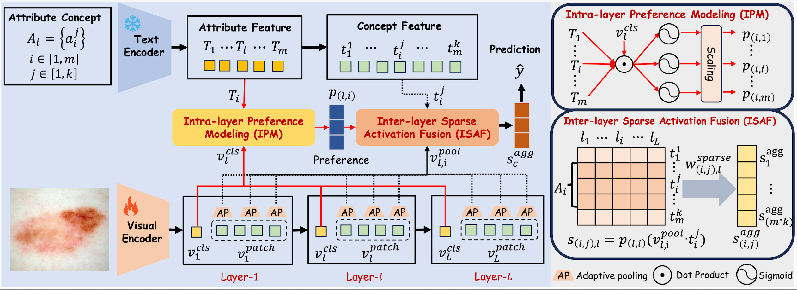

# MVP-CBM: Multi-layer Visual Preference-enhanced Concept Bottleneck Model for Explainable Medical Image Classification 

This repository contains the official implementation of "[MVP-CBM: Multi-layer Visual Preference-enhanced Concept Bottleneck Model for Explainable Medical Image Classification ( IJCAI 2025 )](url)"

## Abstract

The concept bottleneck model (CBM), as a technique improving interpretability via linking pre-
dictions to human-understandable concepts, makes high-risk and life-critical medical image classification credible. Typically, existing CBM methods associate the final layer of visual encoders with concepts to explain the model’s predictions. However, we empirically discover the phenomenon of concept preference variation, that is, the concepts are preferably associated with the features at different layers than those only at the final layer; yet a blind last-layer-based association neglects such a preference variation and thus weakens the accurate correspondences between features and concepts, impairing model interpretability. To address this issue, we propose a novel Multi-layer Visual Preference-enhanced Concept Bottle-neck Model (MVP-CBM), which comprises two key novel modules: (1) intra-layer concept preference modeling, which captures the preferred association of different concepts with features at various visual layers, and (2) multi-layer concept sparse activation fusion, which sparsely aggregates concept activations from multiple layers to enhance performance. Thus, by explicitly modeling concept preferences, MVP-CBM can comprehensively leverage multi-layer visual information to provide a more nuanced and accurate explanation of model decisions. Extensive experiments on several public medical classification benchmarks demonstrate that MVP-CBM achieves state-of-the-art accuracy and interoperability, verifying its superiority.



## Key Features

- Discovers the phenomenon of concept preference variation in Concept Bottleneck Models (CBMs).
- Develops intra-layer concept preference modeling(ICPM), which captures the preferred association of different concepts with features at various visual layers.
- Develops multi-layer concept sparse activation fusion(MCSAF), which sparsely aggregates concept activations from multiple layers to enhance performance.
- Extensive experiments on medical image analysis show it achieves state-of-the-art accuracy and interoperability.

## Usage
Python version >= 3.8.20


```bash
git clone 
cd MVP-CBM
conda env create -f environment.yaml
```

Download the dataset from ISIC2018 website and process with scripts under `dataset_utils` or use the our processed files from [Google Drive](https://drive.google.com/drive/folders/1vf6X44zALelFXQNCAmg0_VizT4yxRkse?usp=drive_link)

To train blackbox baseline model like ResNet or ViT, use
```bash
python train_blackbox.py --model resnet50.a1_in1k --data-path path_to_the_dataset --gpu 0
```
To train Explicd, use
```bash
# isic2018
# cm
# busi
# cmmd
# nct
# siim
# idrid
python train_mvpcbm.py -d busi --data-path ./dataset/busi/ --gpu 0


```

The queried diagnostic criteria and concepts from GPT-o1 are in `train_mvpcbm.py`

## Citation

If you find this work useful in your research, please consider citing:

```bibtex
@inproceedings{ijcai2025p60,
  title     = {MVP-CBM: Multi-layer Visual Preference-enhanced Concept Bottleneck Model for Explainable Medical Image Classification},
  author    = {Wang, Chunjiang and Zhang, Kun and Liu, Yandong and He, Zhiyang and Tao, Xiaodong and Zhou, S. Kevin},
  booktitle = {Proceedings of the Thirty-Fourth International Joint Conference on
               Artificial Intelligence, {IJCAI-25}},
  publisher = {International Joint Conferences on Artificial Intelligence Organization},
  editor    = {James Kwok},
  pages     = {529--537},
  year      = {2025},
  month     = {8},
  note      = {Main Track},
  doi       = {10.24963/ijcai.2025/60},
  url       = {https://doi.org/10.24963/ijcai.2025/60},
}

```
## Acknowledgements

Our sincere thanks to the contributors of [Explicd](https://github.com/yhygao/Explicd) for their foundational work, which greatly facilitated the development of MVP-CBM.


